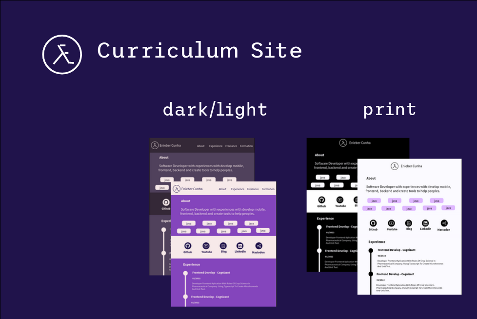

# Curriculum Site

The curriculo site create with nextjs and update content data from json. Redy to print.

## Template penpot

This project is design with penpot and can download from [library templates](https://github.com/penpot/penpot-files/blob/main/Curriculum-by-Enieber.penpot).

## License

MPL (https://www.mozilla.org/en-US/MPL/)
